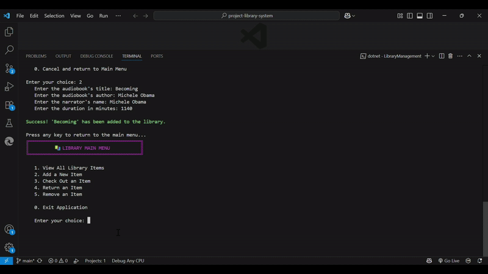
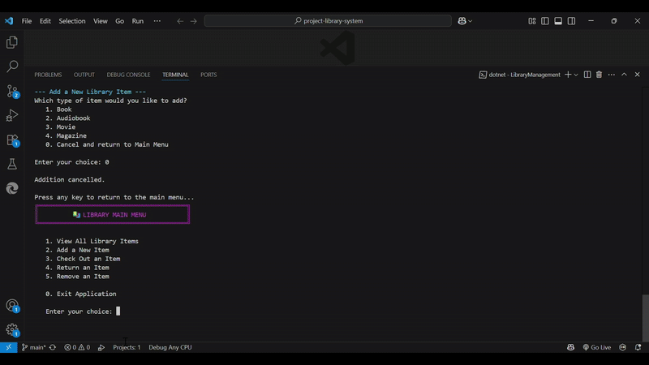
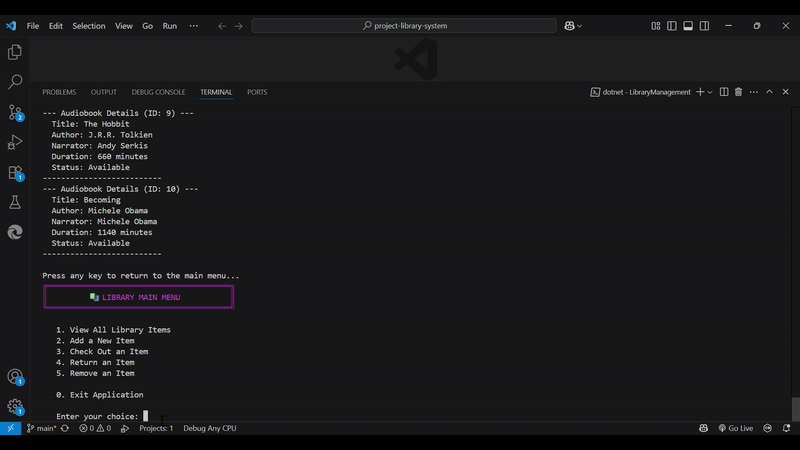
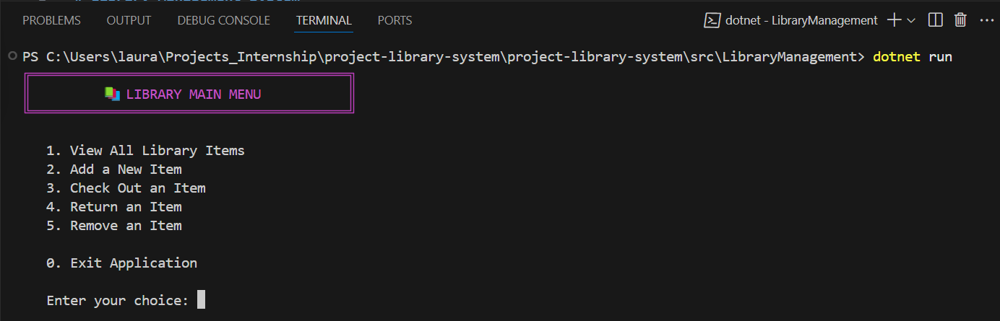
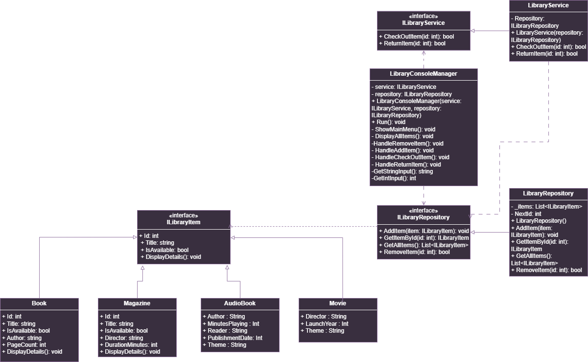
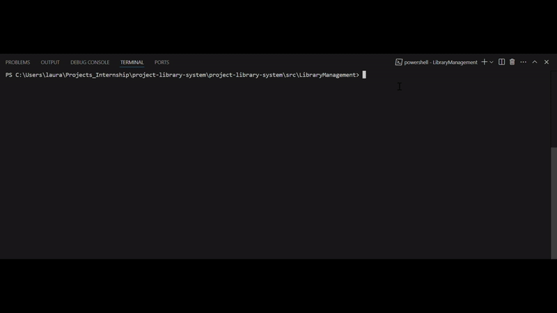

# Library Management System
A simple yet robust console-based application for managing a collection of library items like books, movies, magazines, and audiobooks. This project is built with C\# and .NET, focusing on clean architecture and SOLID design principles.

---

## 🎇Features

  * **Add New Items**: Add new books, movies, magazines, or audiobooks to the library inventory.

    

  * **View All Items**: Display a complete, formatted list of all items currently in the library.

    

  * **Check Out Items**: Mark an item as unavailable for borrowing.

    

  * **Return Items**: Mark a checked-out item as available again.

    

  * **Remove Items**: Permanently delete an item from the inventory.

    

  * **Interactive Console UI**: A user-friendly, menu-driven interface for easy navigation.

    

---

## 🎇Tech Stack & Architecture

This project is built using **.NET** and **C\#**, with a strong emphasis on professional software design patterns.

### Architectural Design

The application is built upon a clean, 3-tier architecture that separates concerns and follows all five **SOLID** principles:

1.  **UI Layer (`LibraryConsoleManager`)**: Responsible for all user interaction.
2.  **Business Logic Layer (`LibraryService`)**: Contains the core application rules and orchestrates actions.
3.  **Data Layer (`LibraryRepository`)**: Manages the in-memory data storage.

This decoupled design is achieved through **Dependency Inversion**, where high-level modules depend on abstractions (interfaces) rather than concrete implementations.

### UML Class Diagram

The following diagram illustrates the complete architecture of the system:



---

## 🎇Technologies Used

* **Language:** C#
* **Framework:** .NET 8 (or your specific version)
* **Development Environment:** Visual Studio Code / Visual Studio 2022

---

## 🎇Starting the project

To get a local copy up and running, please follow these simple steps.

### Prerequisites

You will need the [.NET SDK](https://dotnet.microsoft.com/en-us/download) installed on your machine.

### Installation & Running

1.  **Clone the repository to your local machine:**
    ```sh
    git clone [https://github.com/rcoon084/project-library-system.git](https://github.com/rcoon084/project-library-system.git)
    ```

2.  **Navigate to the project's source directory:**
    ```sh
    cd project-library-system/src/LibraryManagement
    ```

3.  **Run the application from the command line:**
    ```sh
    dotnet run
    ```
    The application menu will appear in your console.

    
    

---

<p align="center">
  
</p>
